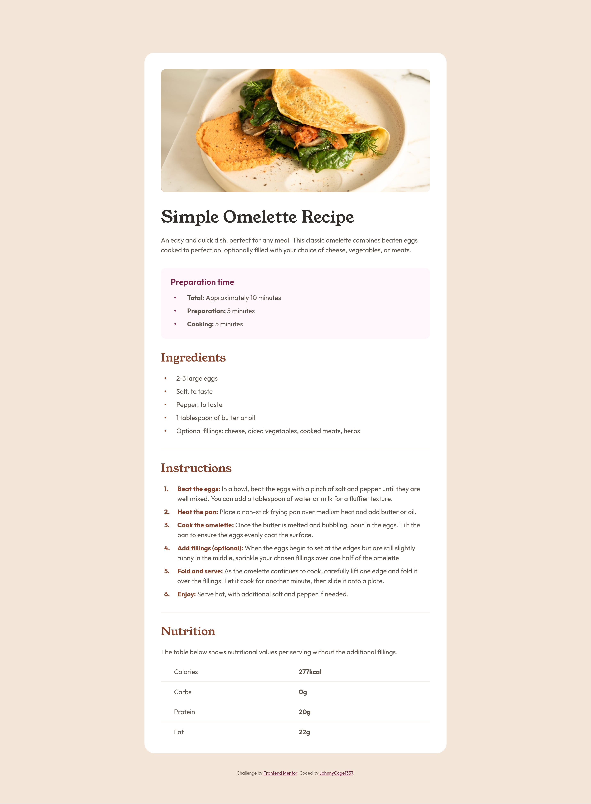
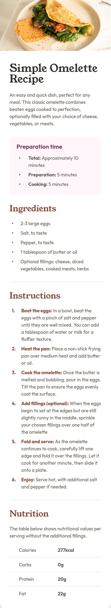

# Frontend Mentor - Recipe page solution

This is a solution to the [Recipe page challenge on Frontend Mentor](https://www.frontendmentor.io/challenges/recipe-page-KiTsR8QQKm). Frontend Mentor challenges help you improve your coding skills by building realistic projects.

## Table of contents

- [Overview](#overview)
  - [The challenge](#the-challenge)
  - [Screenshot](#screenshot)
  - [Links](#links)
- [My process](#my-process)
  - [Built with](#built-with)
  - [What I learned](#what-i-learned)
  - [Useful resources](#useful-resources)


## Overview

### Screenshot

#### Desktop


#### Mobile


### Links

- Solution URL: [Github](https://github.com/JohnnyCage1337/Recipe-page)
- Live Site URL: [Github Pages](https://johnnycage1337.github.io/Recipe-page/)

## My process

### Built with

- Semantic HTML5 markup
- CSS custom properties
- Flexbox
- relative/absolute positioning for bullet points

### What I learned

#### HTML
##### 1. Full Sematnic HTML Aproach
- Use `<dl>`(Description list) for key-value information
- Use `<time>` for date/time values
```cs
      <section class="preparation_container">
        <h2 class="preparation_container__heading">Preparation time</h2>
        <dl class="preparation_container__list">
          <div class="preparation_container__list__row">
            <dt class="preparation_container__list__term">Total</dt>
            <dd class="preparation_container__list__def">Approximately <time datetime="PT10M">10 minutes</time></dd>
          </div>
          <div class="preparation_container__list__row">
            <dt class="preparation_container__list__term">Preparation</dt>
            <dd class="preparation_container__list__def"><time datetime="PT5M"></time>5 minutes</dd>
          </div>
          <div class="preparation_container__list__row">
            <dt class="preparation_container__list__term">Cooking</dt>
            <dd class="preparation_container__list__def"><time datetime="PT5M"></time>5 minutes</dd>
          </div>
        </dl>
      </section>
```
- use `<hr>` to seperate topics of the recipe
- use `<br>` to bring attention to the name of the step in the instruction of the preperation. It's better than strong because it only tells youser to bring attnetion not to get to know ASAP with it(strong does that)

```css
<li class="instructions_container__list__item">
  <p><b>Fold and serve</b> As the omelette continues to cook, carefully lift one edge and fold it over the fillings. Let it cook for another minute, then slide it onto a plate.</p>
</li>
```
- use `<section>` element to seperate logic topis of the recipe page

- use `<abbr>`


#### CSS
- setting css parametrs for all childs of div by this syntax
```css
.recipe_container > * + * {
  margin-top: var(--sp-400);
```

##### Responsive with of the card
- setting `max-width` nad `width` will decrease card when winndow/device width is smaller
```css
main {
  width: 100%;
  max-width: 46rem;
  background-color: var(--color-white);
  padding: var(--sp-500);
  border-radius: var(--sp-300);

```
- discover `object-fit` and `object-position`
- `object-fit` describe how image will response for changing width
- `object-position` describe from which side image will increase decrease(left,right mid)
```css
.image {
  height: 18.75rem;
  width: 100%;
  border-radius: var(--sp-150);
  object-fit: cover;
  object-position: center;
}
```

- use ::before selector to create bullet points and number points for list. You have better control of layout of the list items by defining own selector. Also need to use `position: relative/absolute (parent/child)` to precizebly setting point. Creatin own counter for order list.
```css

.instructions_container__list__item::before {
  position: absolute;
  left: 0.5rem;
  top: 0;
  content: counter(instructions-counter) ".";
  font-weight: bold;
  color: var(--color-brown-800);
}
```

- create dedicated styles for mobile with `@media-queries`
```css
@media (max-width: 500px) {
  body {
    padding: 0;
  }

  main {
    padding: 0;
  }

  .image {
    border-radius: 0;
    height: 171px;
  }
  .recipe_container {
    padding: var(--sp-500) var(--sp-400);
  }

  .title {
    margin-top: 0;
    font-size: 2.25rem;
  }
}

```

- selectors like :not, :firstchild, :lastchild to style exact li without creating new classes or ids

- centering table-like element using `flex 1 0 0`(flex-grow, flex-shrink, flex-start)

### Useful resources

- [b html tag](https://developer.mozilla.org/en-US/docs/Web/HTML/Reference/Elements/b) - Details about used by me `<b>` html tag.
- [Flexbox tricks](https://css-tricks.com/snippets/css/a-guide-to-flexbox/) - Helped with flexbox usage.

